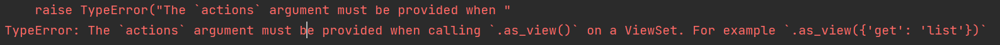
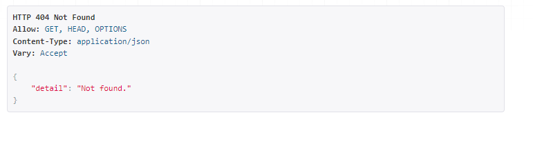

## Solve error 1


If This error occurs. You should do
- Go to urls.py and add
```
from rest_framework.routers import DefaultRouter
from . import views

router = DefaultRouter()
router.register('', views.ViewNameGoesHere)

urlpatterns = router.urls
```

## DefaultRouter error

When this type of error occurs. You must add the root router at the bottom of the router list. Like so...
```

router.register('api', views.PostModelView)
router.register('', views.PostModelViewReadOnly)
```